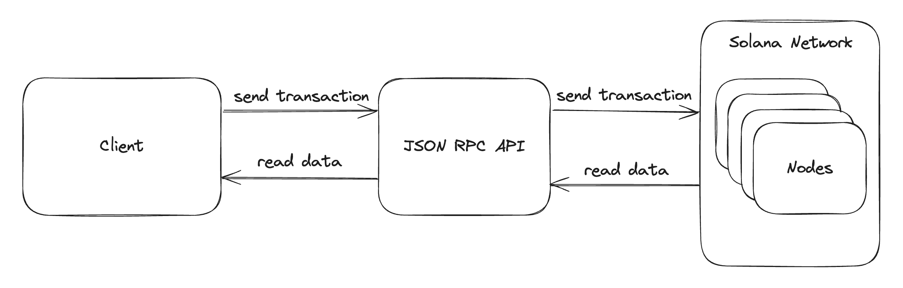

# solana-in-action
solana in Action

# What is Solana
Solana is a blockchain built for large-scale applications. It is a high-performance network that can be used for a range of applications, including finance, payments and gaming. Solana runs on an independent global state machine and is open, interoperable and decentralized.

# Why Solana?
Solana is designed for scaling, built for blockchain applications to reach millions of users. Instead of worrying about optimizing for the blockchain layer, developers can focus on building their applications to reach product market fit. Not only can it now scale according to blockchain application needs, but the network will continue to optimize and take into account the user experience.

Building the best user experience in your application is a top priority for developers. With blockchain, the user experience is often limited by the underlying technology, resulting in slow response times and high fees. Solana's low fees and 400 ms confirmation time enable developers to build applications that are user-friendly and accessible to everyone.

# Install solana
You need to install the local environment, see the following documentation:
- https://solana.com/docs/intro/installation
- https://solana.com/zh/docs/intro/installation
1. install rust
```shell
curl --proto '=https' --tlsv1.2 -sSf https://sh.rustup.rs | sh -s -- -y
```
then add env to ~/.bash_profile
```shell
. "$HOME/.cargo/env"
```

2. install solana
```shell
sh -c "$(curl -sSfL https://release.anza.xyz/stable/install)"
```
3. add env
```shell
export PATH="$HOME/.local/share/solana/install/active_release/bin:$PATH"
```
source ~/.bash_profile

4. view the solana version
```shell
solana --version
solana-cli 1.18.24 (src:6b04e881; feat:3241752014, client:Agave)
```
To later update the Solana CLI to the latest version, you can use the following command:
```shell
agave-install update
```

# Install Anchor CLI
```shell
cargo install --git https://github.com/coral-xyz/anchor avm --force
```
Test to ensure AVM was installed and is accessible:
```shell
avm --version
```
Install the latest version of Anchor CLI using AVM:
```shell
avm install latest
avm use latest
```
To verify that the installation was successful, check the Anchor CLI version:
```shell
anchor --version
```

# Install nodejs
Go to the following address to download nodejs and install nodejs.lts is recommended.
- https://nodejs.org/

# Solana cli basic
1. Solana Config
```shell
solana config get
```
You can update the Solana CLI cluster using the following commands:
```shell
solana config set --url mainnet-beta
solana config set --url devnet
solana config set --url localhost # localhost dev
solana config set --url testnet
```
You can also use the following short options:
```shell
solana config set -um    # For mainnet-beta
solana config set -ud    # For devnet
solana config set -ul    # For localhost
solana config set -ut    # For testnet
```
Here I'm setting up the local environment.
```shell
solana config set -ul 
```

2. Create Wallet:
To interact with the Solana network using the Solana CLI, you need a Solana wallet funded with SOL.

To generate a keypair at the default Keypair Path, run the following command:
```shell
solana-keygen new
```
Just press enter

```
Generating a new keypair

For added security, enter a BIP39 passphrase

NOTE! This passphrase improves security of the recovery seed phrase NOT the
keypair file itself, which is stored as insecure plain text

BIP39 Passphrase (empty for none):

Wrote new keypair to $HOME/.config/solana/id.json
=============================================================================
pubkey: xxx
=============================================================================
Save this seed phrase and your BIP39 passphrase to recover your new keypair:
purse immense invite echo cement robust grid birth order garage moment behave
=============================================================================
```
Once a keypair is generated, you can get the address (public key) of the keypair with the following command:
```shell
solana address
```
3. Airdrop SOL

Once you've set up your local wallet, request an airdrop of SOL to fund your wallet. You need SOL to pay for transaction fees and to deploy programs.

Set your cluster to the devnet:
```shell
solana config set -ud
```
Then request an airdrop of devnet SOL:
```shell
solana airdrop 2
```
To check your wallet's SOL balance, run the following command:
```shell
solana balance
```
4. Run Local Validator
Running a local validator will allow you to deploy and test your programs locally.

In a separate terminal, run the following command to start a local validator:
```shell
solana-test-validator
```
output:
```
Ledger location: test-ledger
Log: test-ledger/validator.log
⠁ Initializing...                                                                                                                          Waiting for fees to stabilize 1...
Identity: xxx
Genesis Hash: xxx
Version: 1.18.24
Shred Version: 49046
Gossip Address: 127.0.0.1:1024
TPU Address: 127.0.0.1:1027
JSON RPC URL: http://127.0.0.1:8899
WebSocket PubSub URL: ws://127.0.0.1:8900
⠐ 00:00:41 | Processed Slot: 84 | Confirmed Slot: 84 | Finalized Slot: 52 | Full Snapshot Slot: - | Incremental Snapshot Slot: - | Transactio
```
Make sure to update the Solana CLI config to localhost before commands.
```shell
solana config set -ul
```

# solana development
Help docs:
- https://solana.com/docs/intro/dev
- https://www.solana-cn.com/SolanaDocumention/intro/dev.html

Solana's development can be divided into two main parts:
- On-chain program development(链上程序开发）: This is where you create and deploy custom programs directly to the blockchain. Once deployed, they are available to anyone who knows how to communicate with them. You can write these programs in Rust, C, or C++. Rust is currently the most supportive of on-chain application development.
- Client development（客户端开发）: This is the part that writes software (called a decentralized application or dApp) that communicates with on-chain programs. Your application can submit transactions to perform actions on the chain. Client development can be written in any programming language.
Client development currently supports languages such as Rust, Typescript, Python, Java, C++, GO, Kotlin, Dart, etc. I recommend that you use Rust, GO, and Nodejs for client development, mainly because these three languages are rich in ecology, provide more libraries and tools, and more developers, and the cost of development is relatively low.

How does the client work with the Solana blockchain?

    The "glue" between the client side and the onchain side is the Solana JSON RPC API. The client-side sends RPC requests to the Solana network to interact with onchain programs. This is very similar to normal development between a frontend and backend. The major difference with working on Solana is that the backend is a global permissionless blockchain. This means that anyone can interact with your onchain program without the need of issuing API keys or any other form of permission.


# Developer Environments
Choosing the right environment based on your work is very important. On Solana, there are a few different network environments (called clusters) to facilitate mature testing and CI/CD practices:

- Mainnet Beta(主网Beta版): The production network where all the action happens. Transactions cost real money here.
- Devnet(开发网): The quality assurance network where you deploy your programs to test before deploying to production. Think "staging environment".
- Local(本地环境): The local network that you run on your machine using `solana-test-validator` to test your programs. This should be your first choice when developing programs.

At the beginning of learning, it is recommended to use a local environment.

# Client development demo
First make sure you have the nodejs software installed, then execute the following command to create a client development framework application.
```shell
mkdir -p ~/web/rust/solana
cd solana
npx create-solana-dapp helloworld
```
output:
```
Need to install the following packages:
create-solana-dapp@3.1.0
Ok to proceed? (y) y

┌  create-solana-dapp 3.1.0
│
◆  Project name: helloworld
│
◇  Select a preset
│  React + React Router DOM
│
◇  Select a UI library
│  None
│
◇  Select an Anchor template
│  Anchor Counter program with tests
│
◆  Anchor program name: helloworld
│
◇  Successfully created workspace with npm.
│
◒  Installing preset @solana-developers/preset-react@3.1.0...bigint: Failed to load bindings, pure JS will be used (try npm run rebuild?)
◒  Installing preset @solana-developers/preset-react@3.1.0Fetching @nx/rollup...
◇  Successfully installed preset @solana-developers/preset-react@3.1.0.
│
◇  Installation successful! ──────────────────────────────╮
│                                                         │
│  That's it!                                             │
│                                                         │
│  Change to your new directory and start developing:     │
│                                                         │
│  cd ./helloworld                                        │
│                                                         │
│  Start the React app:                                   │
│                                                         │
│  npm run dev                                            │
│                                                         │
│  Run Anchor commands:                                   │
│                                                         │
│  npm run anchor build | test | localnet | deploy        │
│                                                         │
│  Generate more features using the following command:    │
│                                                         │
│  npm run feature                                        │
│                                                         │
│  Could not find Anchor version. Please install Anchor.  │
│                                                         │
│  https://www.anchor-lang.com/docs/installation          │
│                                                         │
├─────────────────────────────────────────────────────────╯
│
└  Good luck with your project!
```
This will create a new project with all the necessary files and basic configuration to start building on Solana. The scaffolding will include a sample front end and an on-chain program template if you choose.
Here I chose React + React Router DOM.

Run the following command to start the application:
```shell
npm run dev
```
output:
```
npm run dev

> @helloworld/source@0.0.0 dev
> nx serve web


> nx run web:serve:development

<i> [webpack-dev-server] Project is running at:
<i> [webpack-dev-server] Loopback: http://localhost:3100/, http://[::1]:3100/
<i> [webpack-dev-server] 404s will fallback to '/index.html'

 NX  Web Development Server is listening at http://localhost:3000/

Entrypoint main [big] 3.3 MiB (4.71 MiB) = runtime.js 50.2 KiB vendor.css 6.18 KiB vendor.js 3.22 MiB main.js 24.3 KiB 4 auxiliary assets
Entrypoint styles [big] 291 KiB (453 KiB) = runtime.js 50.2 KiB styles.css 304 bytes styles.js 240 KiB 3 auxiliary assets
chunk (runtime: runtime) main.js (main) 16.7 KiB [initial] [rendered]
chunk (runtime: runtime) runtime.js (runtime) 33.8 KiB [entry] [rendered]
chunk (runtime: runtime) styles.css, styles.js (styles) 229 KiB (javascript) 265 bytes (css/mini-extract) [initial] [rendered]
chunk (runtime: runtime) vendor.css, vendor.js (vendor) (id hint: vendor) 3.15 MiB (javascript) 6.14 KiB (css/mini-extract) [initial] [rendered] split chunk (cache group: vendor) (name: vendor)
webpack compiled successfully (83a4da51969c0845)
```
The running port can be changed, put in the web/project.json file, you can change according to the actual situation.

create-solana-dapp docs:
- https://github.com/solana-developers/create-solana-dapp?tab=readme-ov-file#create-solana-dapp


# Start building programs locally using Rust
https://solana.com/developers/guides/getstarted/local-rust-hello-world


# solana docs
- https://solana.com/docs/intro/quick-start
- https://solana.com/zh/docs/intro/dev
- https://www.solana-cn.com/SolanaDocumention/home.html
- https://www.solana-cn.com/SolanaBasic/000.html
- https://solana.com/zh/docs/intro/installation
